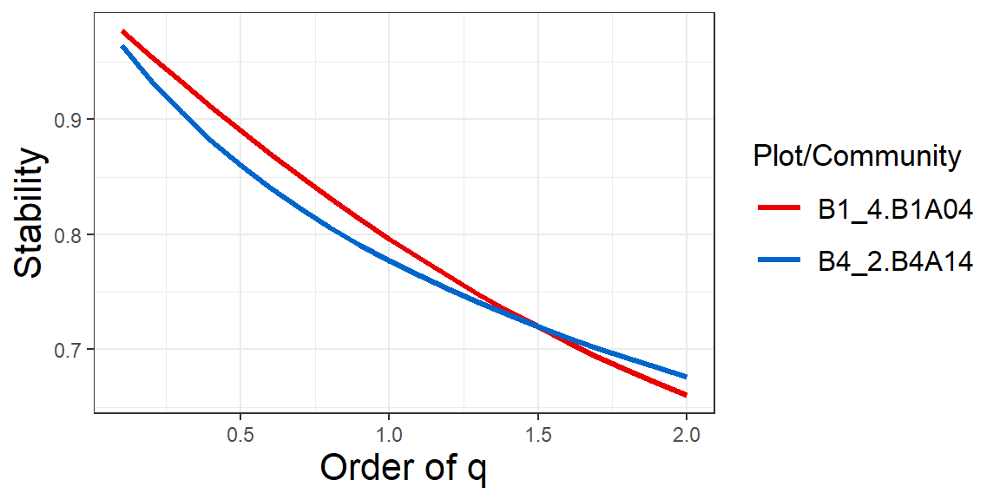
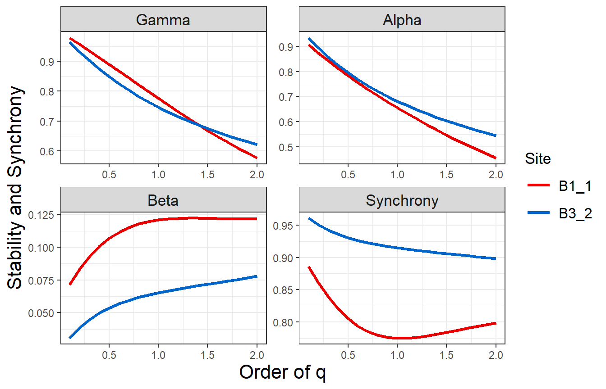
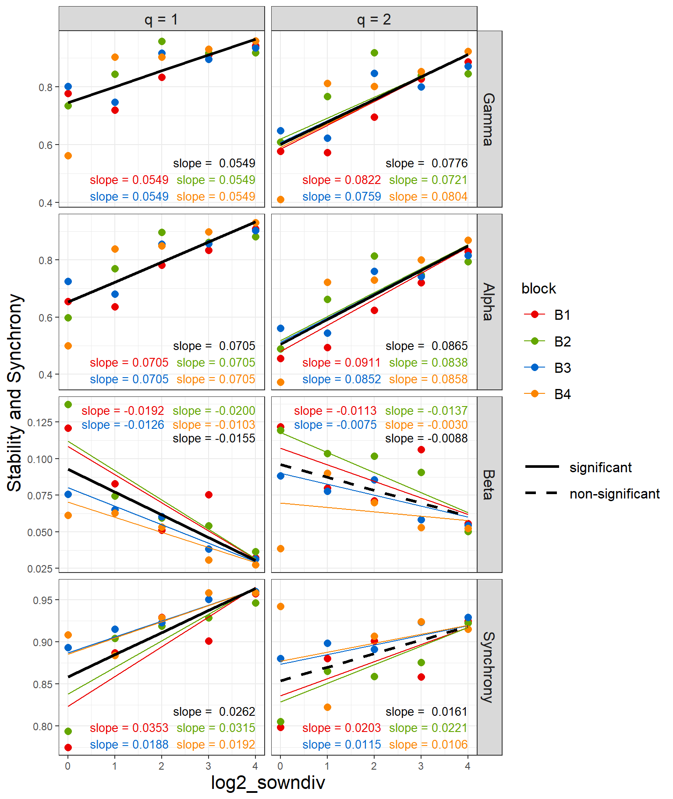
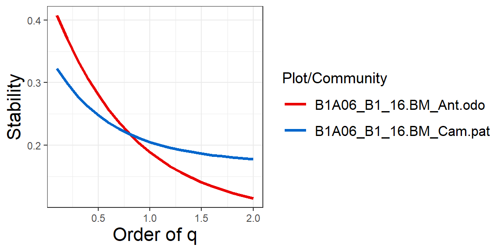
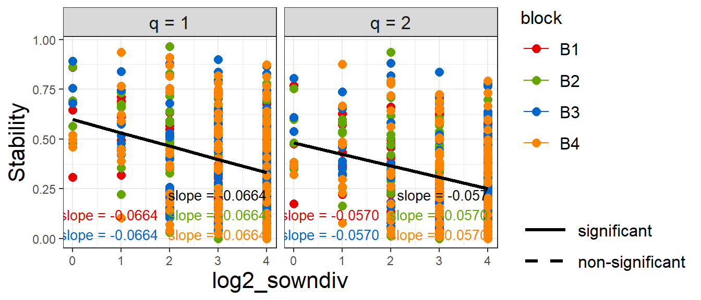
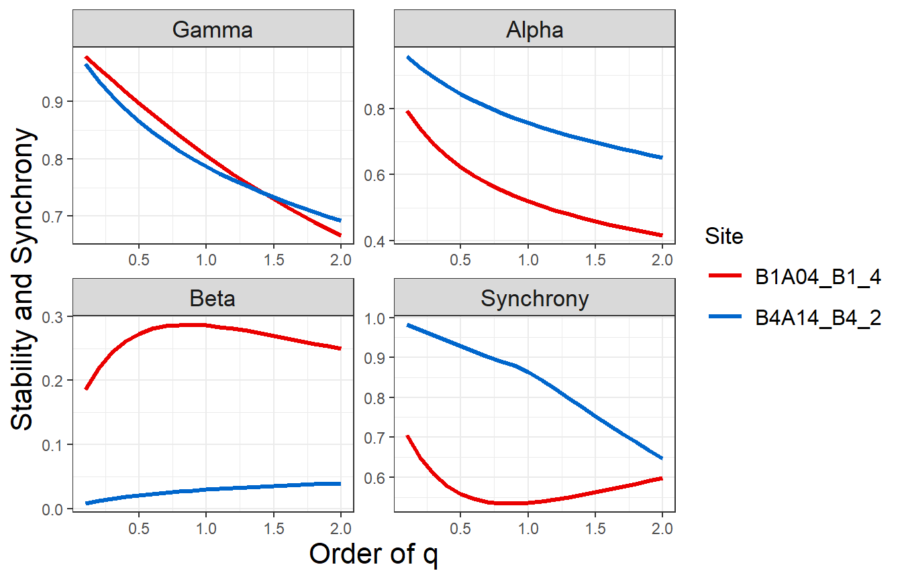
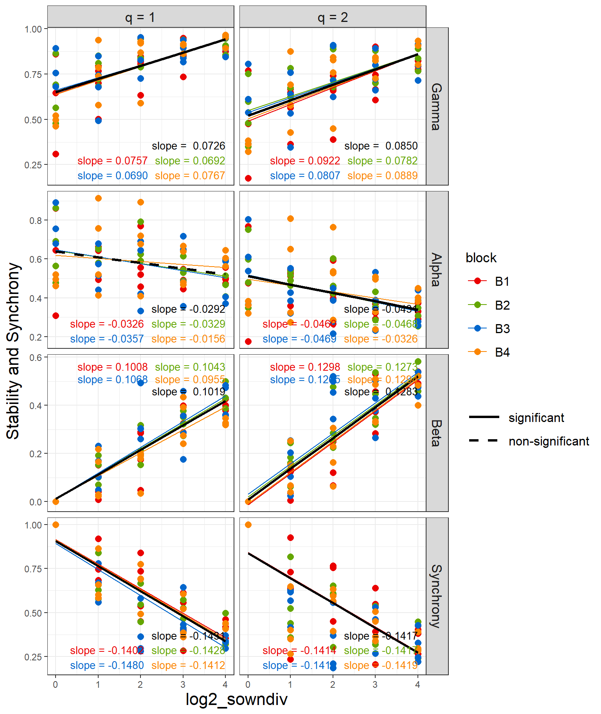
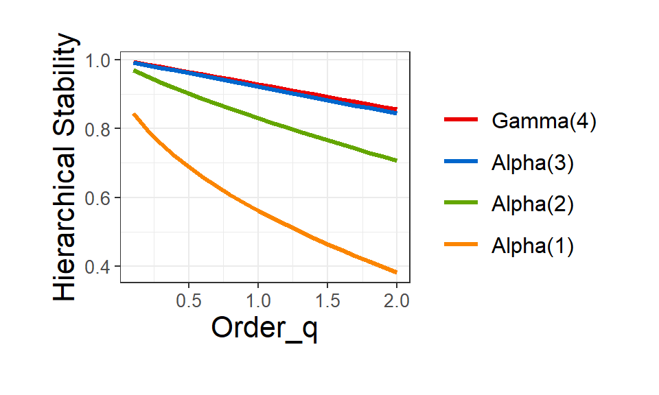
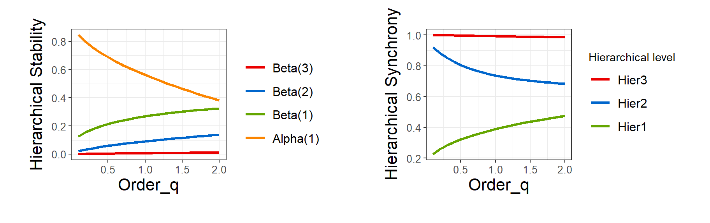

iStay
================

``` r
library(iStay)
```

<font color=#FF6600> </font>

`iStay` (information-based measures of stability and related synchrony)
is an R package for featuring a class of measures of community/ecosystem
stability and related synchrony; the corresponding diversity-stability
is also assessed if biodiversity data are available. The
information-based measures of stability were developed based on the
Hill-number parametrized by an order q \> 0; see Chao et al. (2024) for
the relevant theory and methodological background. All measures are
illustrated by using biomass temporal data from the Jena experiment
(Wagg et al. 2022).

Specifically, iStay features the following measures separately for three
cases:

1)  For a <u>single community</u>, it computes stability measures of
    order q \> 0 and provides the stability profile which depicts the
    stability with respect to order q. When biodiversity data are
    available, the diversity-stability relationship is also assessed.

2)  For <u>multiple communities</u>, it computes four measures (gamma,
    alpha and beta stability and synchrony) and provides the
    corresponding profiles. When biodiversity data are available, the
    diversity-stability and diversity-synchrony relationships are also
    assessed.

3)  For <u>hierarchies</u>, it computes three measures (gamma, alpha,
    and normalized beta stability for data in each hierarchical level)
    of order q \> 0 and provides the stability profile which depicts the
    stability with respect to order q.

## How to cite

If you publish your work based on the results from the iStay package,
you should make references to the following methodology paper and the R
package.

## Software needed to run iStay in R

- Required: [R](https://cran.r-project.org/)
- Suggested: [RStudio
  IDE](https://posit.co/products/open-source/rstudio/#Desktop)

## How to run iStay:

The `iStay` package can be downloaded from CRAN or Github
[iStay_github](https://github.com/AnneChao/iStay) using the following
commands. For a first-time installation, an additional visualization
extension package (`ggplot2`) must be installed and loaded.

``` r
## install iStay package from CRAN
# install.packages("iStay")  

## install the latest version from github
install.packages('devtools')
library(devtools)
install_github("AnneChao/iStay")

## import packages
library(iStay)
```

This package includes five functions, as listed below with default
arguments. See package manual for the detailed description of each
argument.

- **Stay_Single**: calculates stability of the time series data (like
  biomass, productivity, etc.) for single assemblage.

``` r
Stay_Single(data, order.q = c(1, 2), Alltime = TRUE, start_T = NULL, end_T = NULL)
```

- **Stay_Multiple**: calculates Gamma, Alpha and Beta stability, and
  synchrony of the time series data (like biomass, productivity, etc.)
  for multiple assemblages.

``` r
Stay_Multiple(data, order.q = c(1, 2), Alltime = TRUE, start_T = NULL, end_T = NULL)
```

- **Stay_Hier**: calculates stability of the time series data (like
  biomass, productivity, etc.) for hierarchical structure.

``` r
Stay_Hier(data, mat, order.q = c(1, 2), Alltime = TRUE, start_T = NULL, end_T = NULL)
```

- **ggStay_qprofile**: provides to graph the q-profile of stability (and
  synchrony if is multiple assemblages) based on the output obtained
  from the function `Stay_Single`, `Stay_Multiple` or `Stay_Hier`.

``` r
ggStay_qprofile(output)
```

- **ggStay_analysis**: provides to graph the relationships between
  stability (and synchrony if is multiple assemblages) and an additional
  diversity (or other) variable based on the output obtained from the
  function `Stay_Single` or `Stay_Multiple`.

``` r
ggStay_analysis(output, x_variable, by_group = NULL, model = "LMM")
```

## Data input format

For <u>Single community</u> analysis: input data comprises a time series
of biomass (or other pertinent variables). Or it can also comprise
multiple time series data of biomass (or other pertinent variables) that
will calculate stability within each time series; biodiversity
information is optional.

For <u>Multiple communities</u> analysis: input data comprises multiple
time series data of biomass (or other pertinent variables). Or it can
also upload many dataframes about multiple time series data of biomass
that will calculate stability within each dataframe; biodiversity
information is optional.

For <u>Hierarchies</u> analysis: input data comprises multiple time
series data of biomass (or other pertinent variables) and the structure
matrix corresponding to the biomass data.

#### Time series of Biomass data

The biomass data in German Jena experiment are used here to demonstrate
the use of the five functions; see Roscher (2004) and Weisser (2017) for
more comprehensive description of the experimental design and the data
details. We use the biomass time series collected from 76 plots in four
blocks (B1, B2, B3, and B4) for illustrating all measures and depicting
the corresponding diversity-stability relationships. In each block,
plots were sown in a diversity gradient of 1, 2, 4, 8, or 16 plant
species. Each diversity of plant species corresponds to three or four
plots in the block. In each plot, the total biomass of all species is
recorded each year from 2003 to 2024. And also recorded the biomass of
each species each year from 2003 to 2024 except 2004.

There are four datasets provided with the package: (1) 22-years biomass
of plots data (`Jena_plot_biomass_data`), (2) 21-years biomass of
species in each plot data (`Jena_species_biomass_data`), (3)
hierarchical biomass data (`Jena_hierarchical_biomass_data`), (4) and
hierarchical structure matrix data (`Jena_hierarchical_mat`).

The first dataset (`Jena_plot_biomass_data`) is a list including 20 time
series biomass dataframes by considering all possible block-sowndiv
combinations (4 blocks and 5 levels of sown diversity). Each dataframe
includes the plots (as rows) corresponding to same block and number of
sown plants, and 22-years total biomass of all species (as columns) in
each plot.

For this dataset, it mainly use for multiple communities analysis. And
for single community analysis, we can just combines 20 time series
biomass dataframes. Run the following code for the data
`Jena_plot_biomass_data` to view the first ten rows and five columns
(columns 1 to 5) of data using for single community analysis. And view
the first five columns (columns 1 to 5) in the first dataframe (B1_1) of
data using for multiple communities analysis.

``` r
data("Jena_plot_biomass_data")
single_plot <- do.call(rbind, Jena_plot_biomass_data)
head(round(single_plot[,1:5],2), 10)
```

    #>             2003 2004  2005   2006   2007
    #> B1_1.B1A08   760 1053 666.2  304.4  121.3
    #> B1_1.B1A15   663  737 113.4   71.8  167.5
    #> B1_1.B1A18   256  206   9.8   79.2   31.6
    #> B1_16.B1A01  543  459 561.8  743.4  787.5
    #> B1_16.B1A06  822  747 244.8  252.4  432.5
    #> B1_16.B1A11 1035  546 291.0  223.3  439.1
    #> B1_16.B1A20  898 1030 804.3  839.5  979.9
    #> B1_2.B1A05  1187 1248 782.0 1460.0 1810.8
    #> B1_2.B1A07   245  637 611.7  490.4  194.5
    #> B1_2.B1A16   441  259 177.1  200.7  274.4

``` r
data("Jena_plot_biomass_data")
multiple_plot <- Jena_plot_biomass_data
head(round(multiple_plot[[1]][,1:5],2), 10)
```

    #>       2003 2004  2005  2006  2007
    #> B1A08  760 1053 666.2 304.4 121.3
    #> B1A15  663  737 113.4  71.8 167.5
    #> B1A18  256  206   9.8  79.2  31.6

The first dataset contains the total biomass of all species in each
plot. The second dataset (`Jena_species_biomass_data`) contains the
biomass of each individual species in each plot. It is a list including
76 time series biomass dataframes by considering all plots. Each
dataframe includes the species (as rows) in the plot, and 21-years
biomass of each species (as columns) in each plot.

For this dataset, it mainly use for multiple communities analysis. And
for single community analysis, we can just combines 76 time series
biomass dataframes. Run the following code for the data
`Jena_species_biomass_data` to view the first ten rows and five columns
(columns 1 to 5) of data using for single community analysis. And view
the first five columns (columns 1 to 5) in the first dataframe
(B1A01_B1_16) of data using for multiple communities analysis.

``` r
data("Jena_species_biomass_data")
single_species <- do.call(rbind, Jena_species_biomass_data)
head(round(single_species[,1:5],2), 10)
```

    #>                          2003  2005   2006   2007   2008
    #> B1A01_B1_16.BM_Aju.rep   0.12   0.0   0.00   0.00   0.00
    #> B1A01_B1_16.BM_Ant.odo  10.43  32.0   7.57   7.60   2.96
    #> B1A01_B1_16.BM_Ant.syl   0.03   0.0   0.00   0.00   0.00
    #> B1A01_B1_16.BM_Ave.pub   6.53  90.4 124.72  37.32  14.83
    #> B1A01_B1_16.BM_Bro.hor   3.25  19.9   4.20   4.79   0.59
    #> B1A01_B1_16.BM_Car.car   4.28   0.2   1.00   0.00   0.00
    #> B1A01_B1_16.BM_Ger.pra   3.38  17.0  54.30  79.44  43.89
    #> B1A01_B1_16.BM_Lat.pra   0.78  88.3 171.18 129.86  84.43
    #> B1A01_B1_16.BM_Lot.cor  59.33 182.7 191.07  75.07  49.74
    #> B1A01_B1_16.BM_Pla.lan 127.17  51.2 107.97 421.22 257.17

``` r
data("Jena_species_biomass_data")
multiple_species <- Jena_species_biomass_data
head(round(multiple_species[[1]][,1:5],2), 10)
```

    #>              2003  2005   2006   2007   2008
    #> BM_Aju.rep   0.12   0.0   0.00   0.00   0.00
    #> BM_Ant.odo  10.43  32.0   7.57   7.60   2.96
    #> BM_Ant.syl   0.03   0.0   0.00   0.00   0.00
    #> BM_Ave.pub   6.53  90.4 124.72  37.32  14.83
    #> BM_Bro.hor   3.25  19.9   4.20   4.79   0.59
    #> BM_Car.car   4.28   0.2   1.00   0.00   0.00
    #> BM_Ger.pra   3.38  17.0  54.30  79.44  43.89
    #> BM_Lat.pra   0.78  88.3 171.18 129.86  84.43
    #> BM_Lot.cor  59.33 182.7 191.07  75.07  49.74
    #> BM_Pla.lan 127.17  51.2 107.97 421.22 257.17

For hierarchical analysis, we also use the biomass of each species in
every plot to construct hierarchical structure with four levels (Overall
area, Block, Plot and Species). The third dataset
(`Jena_hierarchical_biomass_data`) is the biomass data for hierarchical
analysis, including all species in each plot (as columns) and 21-years
biomass (as rows) of each species (year 2004 is deducted because the
experiment didn’t record the biomass of each species in 2004). Run the
following code to view the first ten rows and five columns (columns 1 to
5):

``` r
data("Jena_hierarchical_biomass_data")
head(round(Jena_hierarchical_biomass_data[,1:5],2), 10)
```

    #>                          2003  2005   2006   2007   2008
    #> B1A01_B1_16_BM_Aju.rep   0.12   0.0   0.00   0.00   0.00
    #> B1A01_B1_16_BM_Ant.odo  10.43  32.0   7.57   7.60   2.96
    #> B1A01_B1_16_BM_Ant.syl   0.03   0.0   0.00   0.00   0.00
    #> B1A01_B1_16_BM_Ave.pub   6.53  90.4 124.72  37.32  14.83
    #> B1A01_B1_16_BM_Bro.hor   3.25  19.9   4.20   4.79   0.59
    #> B1A01_B1_16_BM_Car.car   4.28   0.2   1.00   0.00   0.00
    #> B1A01_B1_16_BM_Ger.pra   3.38  17.0  54.30  79.44  43.89
    #> B1A01_B1_16_BM_Lat.pra   0.78  88.3 171.18 129.86  84.43
    #> B1A01_B1_16_BM_Lot.cor  59.33 182.7 191.07  75.07  49.74
    #> B1A01_B1_16_BM_Pla.lan 127.17  51.2 107.97 421.22 257.17

#### Structure matrix for hierarchies

For the `Jena_hierarchical_biomass_data` biomass dataset, there is a
corresponding structure matrix called `Jena_hierarchical_mat`. This
matrix contains three columns representing the hierarchical levels from
highest to lowest (excluding the overall area): “Block”, “Plot”, and
“Species”. Each row of `Jena_hierarchical_mat` corresponds to a row in
the biomass dataset, indicating the category to which that biomass
measurement belongs at each hierarchical level. Run the following code
to view the first ten rows:

``` r
data("Jena_hierarchical_mat")
head(Jena_hierarchical_mat, 10)
```

    #>    block  plot       species
    #> 1     B1 B1A01 B1A01_Aju.rep
    #> 2     B1 B1A01 B1A01_Ant.odo
    #> 3     B1 B1A01 B1A01_Ant.syl
    #> 4     B1 B1A01 B1A01_Ave.pub
    #> 5     B1 B1A01 B1A01_Bro.hor
    #> 6     B1 B1A01 B1A01_Car.car
    #> 7     B1 B1A01 B1A01_Ger.pra
    #> 8     B1 B1A01 B1A01_Lat.pra
    #> 9     B1 B1A01 B1A01_Lot.cor
    #> 10    B1 B1A01 B1A01_Pla.lan

## Computing plot stability in a single plot with plotting plot stability-profile and relationship between plot stability and diversity variable.

Based on biomass data, `Stay_Single()` computes stability of each
community (plot) for the set order q. And `ggStay_qprofile()` provides
to plot stability-profile. If combine the diversity information to
output of `Stay_Single()`, can use `ggStay_analysis()` to plot the
relationship between stability and diversity information. For
stability-profile, following sets order q from 0.1 to 2.0 in increments
of 0.1, and uses 22-years biomass of only two plots “B1A04” and “B4A14”,
to avoid an overly complicated graph. For diversity-stability
relationship, following use the default setting of order q (q = 1 and q
= 2) and use 22-years biomass of all 76 plots.

Run the following code to view the first ten rows of the output:

``` r
single_plot <- do.call(rbind, Jena_plot_biomass_data)
output_single_q <- Stay_Single(data = single_plot[which(rownames(single_plot) %in% c("B1_4.B1A04", "B4_2.B4A14")),],
                               order.q = seq(0.1,2,0.1),
                               Alltime=TRUE)
head(output_single_q, 10)
```

    #>    Plot/Community Order_q Stability
    #> 1      B1_4.B1A04     0.1     0.977
    #> 2      B4_2.B4A14     0.1     0.964
    #> 3      B1_4.B1A04     0.2     0.955
    #> 4      B4_2.B4A14     0.2     0.933
    #> 5      B1_4.B1A04     0.3     0.933
    #> 6      B4_2.B4A14     0.3     0.906
    #> 7      B1_4.B1A04     0.4     0.911
    #> 8      B4_2.B4A14     0.4     0.882
    #> 9      B1_4.B1A04     0.5     0.890
    #> 10     B4_2.B4A14     0.5     0.860

The above output includes the name of plot or community
(`Plot/Community`), `Order_q` and stability of each plot or community
(`Stability`).

Run the following code to obtain stability-profile:

``` r
ggStay_qprofile(output = output_single_q)
```



Run the following code to obtain diversity-plot stability relationship.
Need to combine the diversity information to output of `Stay_Single()`
first (following only shows the first ten rows).

``` r
output_single_div <- Stay_Single(data = single_plot, order.q = c(1,2), Alltime = TRUE)
output_single_div <- data.frame(output_single_div,
                                log2_sowndiv = log2(as.numeric(do.call(rbind,
                                                   strsplit(output_single_div[,1],"[._]+"))[,2])),
                                block=do.call(rbind, strsplit(output_single_div[,1],"[._]+"))[,1])
colnames(output_single_div)[1] <- c("Plot/Community")
head(output_single_div, 10)
```

    #>    Plot/Community Order_q Stability log2_sowndiv block
    #> 1      B1_1.B1A08       1     0.825            0    B1
    #> 2      B1_1.B1A15       1     0.294            0    B1
    #> 3      B1_1.B1A18       1     0.635            0    B1
    #> 4     B1_16.B1A01       1     0.881            4    B1
    #> 5     B1_16.B1A06       1     0.878            4    B1
    #> 6     B1_16.B1A11       1     0.902            4    B1
    #> 7     B1_16.B1A20       1     0.950            4    B1
    #> 8      B1_2.B1A05       1     0.518            1    B1
    #> 9      B1_2.B1A07       1     0.679            1    B1
    #> 10     B1_2.B1A16       1     0.778            1    B1

``` r
ggStay_analysis(output = output_single_div, x_variable = "log2_sowndiv", 
                by_group = "block", model = "LMM")
```


## Computing plot stability in multiple plots with plotting plot stability-profile and relationship between plot stability and diversity variable.

Based on biomass data, `Stay_Multiple()` computes plot stability of each
group of multiple communities (plots) for the set order q. And
`ggStay_qprofile()` provides to plot stability-profile. If combine the
diversity information to output of `Stay_Single()`, can use
`ggStay_analysis()` to plot the relationship between stability and
diversity information. For stability-profile, following sets the order q
from 0.1 to 2.0 in increments of 0.1, and uses 22-years biomass of only
two groups of multiple communities (plots) “B1_1” and “B3_2”, to avoid
an overly complicated graph. For diversity-stability relationship,
following use the default setting of order q (q = 1 and q = 2) and use
22-years biomass of all 20 groups of multiple communities (plots).

Run the following code to view the first ten rows of the output:

``` r
multiple_plot <- Jena_plot_biomass_data
output_multi_q <- Stay_Multiple(data = multiple_plot[which(names(multiple_plot) %in% c("B1_1",  "B3_2"))],
                                order.q = seq(0.1,2,0.1), Alltime=TRUE)
head(output_multi_q, 10)
```

    #>    Site Order_q Gamma Alpha   Beta Synchrony
    #> 1  B1_1     0.1 0.978 0.907 0.0714     0.886
    #> 2  B3_2     0.1 0.965 0.934 0.0305     0.961
    #> 3  B1_1     0.2 0.957 0.873 0.0833     0.861
    #> 4  B3_2     0.2 0.932 0.894 0.0384     0.951
    #> 5  B1_1     0.3 0.935 0.842 0.0930     0.839
    #> 6  B3_2     0.3 0.902 0.858 0.0447     0.943
    #> 7  B1_1     0.4 0.912 0.812 0.1007     0.820
    #> 8  B3_2     0.4 0.875 0.825 0.0497     0.936
    #> 9  B1_1     0.5 0.890 0.783 0.1068     0.805
    #> 10 B3_2     0.5 0.849 0.795 0.0537     0.931

The above output includes the name of group of multiple communities
(`Site`), `Order_q`, stability and synchrony of each group of multiple
communities (`Gamma`, `Alpha`, `Beta` stability and `Synchrony`).

Run the following code to obtain plot stability and synchorny profile:

``` r
ggStay_qprofile(output=output_multi_q)
```



Run the following code to obtain diversity-plot stability relationship.
Need to combine the diversity information to output of `Stay_Multiple()`
first (following only shows the first ten rows).

``` r
output_multi_div <- Stay_Multiple(data=multiple_plot, order.q=c(1,2), Alltime=TRUE)

output_multi_div <- data.frame(output_multi_div,
                               log2_sowndiv = log2(as.numeric(do.call(rbind, strsplit(output_multi_div[, 1], "_"))[, 2])),
         block = do.call(rbind, strsplit(output_multi_div[, 1], "_"))[, 1])
rownames(output_multi_div) <- NULL
head(cbind(output_multi_div[,1:2], round(output_multi_div[3:6],3), output_multi_div[,7:8]), 10)
```

    #>     Site Order_q Gamma Alpha  Beta Synchrony log2_sowndiv block
    #> 1   B1_1       1 0.776 0.655 0.121     0.775            0    B1
    #> 2  B1_16       1 0.942 0.909 0.032     0.957            4    B1
    #> 3   B1_2       1 0.719 0.636 0.083     0.887            1    B1
    #> 4   B1_4       1 0.833 0.782 0.051     0.929            2    B1
    #> 5   B1_8       1 0.910 0.835 0.075     0.901            3    B1
    #> 6   B2_1       1 0.735 0.598 0.137     0.794            0    B2
    #> 7  B2_16       1 0.918 0.882 0.036     0.946            4    B2
    #> 8   B2_2       1 0.844 0.769 0.074     0.904            1    B2
    #> 9   B2_4       1 0.957 0.898 0.060     0.919            2    B2
    #> 10  B2_8       1 0.916 0.862 0.054     0.929            3    B2

``` r
ggStay_analysis(output = output_multi_div, x_variable = "log2_sowndiv", 
                    by_group = "block", model = "LMM")
```



Above examples use the data about biomass of total species in each plot
(`Jena_plot_biomass_data`) to calculate plot stability. Following
example use the data about biomass of each species in each plot
(`Jena_species_biomass_data`) to calculate species stability.

## Computing species stability in a single species in each plot with plotting species stability-profile and relationship between species stability and diversity variable.

Based on biomass data, `Stay_Single()` computes stability of each
species in each plot for the set order q. And `ggStay_qprofile()`
provides to plot stability-profile. If combine the diversity information
to output of `Stay_Single()`, can use `ggStay_analysis()` to plot the
relationship between stability and diversity information. For
stability-profile, following sets order q from 0.1 to 2.0 in increments
of 0.1, and uses 21-years biomass of only two species in B1A06, which
are “Ant.odo” and “Cam.pat” to avoid too complicated graph; For
diversity-stability relationship, following use the default setting of
order q (q = 1 and q = 2) and use 21-years biomass of all 462 species
(each species in each plot).

Run the following code to view the first ten rows of the output:

``` r
single_species <- do.call(rbind, Jena_species_biomass_data)
output_single_species_q <- Stay_Single(data = single_species[which(rownames(single_species) %in% c("B1A06_B1_16.BM_Ant.odo", "B1A06_B1_16.BM_Cam.pat")),],
                                       order.q=seq(0.1,2,0.1), Alltime=TRUE)
head(output_single_species_q, 10)
```

    #>            Plot/Community Order_q Stability
    #> 1  B1A06_B1_16.BM_Ant.odo     0.1     0.408
    #> 2  B1A06_B1_16.BM_Cam.pat     0.1     0.322
    #> 3  B1A06_B1_16.BM_Ant.odo     0.2     0.370
    #> 4  B1A06_B1_16.BM_Cam.pat     0.2     0.299
    #> 5  B1A06_B1_16.BM_Ant.odo     0.3     0.336
    #> 6  B1A06_B1_16.BM_Cam.pat     0.3     0.279
    #> 7  B1A06_B1_16.BM_Ant.odo     0.4     0.307
    #> 8  B1A06_B1_16.BM_Cam.pat     0.4     0.262
    #> 9  B1A06_B1_16.BM_Ant.odo     0.5     0.280
    #> 10 B1A06_B1_16.BM_Cam.pat     0.5     0.248

The above output includes the name of plot or community
(`Plot/Community`), `Order_q` and stability of each plot or community
(`Stability`).

Run the following code to obtain stability-profile:

``` r
ggStay_qprofile(output = output_single_species_q)
```



Run the following code to obtain diversity-plot stability relationship.
Need to combine the diversity information to output of `Stay_Single()`
first (following only shows the first ten rows).

``` r
output_single_species_div <- Stay_Single(data = single_species,
                                         order.q = c(1,2), Alltime=TRUE)
output_single_species_div <- data.frame(output_single_species_div,
                              log2_sowndiv = log2(as.numeric(do.call(rbind,
                                      strsplit(output_single_species_div[,1],"[._]+"))[,3])),
                              block = do.call(rbind,
                                    strsplit(output_single_species_div[,1],"[._]+"))[,2])
head(output_single_species_div, 10)
```

    #>            Plot.Community Order_q Stability log2_sowndiv block
    #> 1  B1A01_B1_16.BM_Aju.rep       1     0.139            4    B1
    #> 2  B1A01_B1_16.BM_Ant.odo       1     0.283            4    B1
    #> 3  B1A01_B1_16.BM_Ant.syl       1     0.000            4    B1
    #> 4  B1A01_B1_16.BM_Ave.pub       1     0.641            4    B1
    #> 5  B1A01_B1_16.BM_Bro.hor       1     0.216            4    B1
    #> 6  B1A01_B1_16.BM_Car.car       1     0.102            4    B1
    #> 7  B1A01_B1_16.BM_Ger.pra       1     0.634            4    B1
    #> 8  B1A01_B1_16.BM_Lat.pra       1     0.551            4    B1
    #> 9  B1A01_B1_16.BM_Lot.cor       1     0.465            4    B1
    #> 10 B1A01_B1_16.BM_Pla.lan       1     0.520            4    B1

``` r
ggStay_analysis(output=output_single_species_div, x_variable="log2_sowndiv",
                    by_group="block", model="LMM")
```



## Computing species stability in multiple species with plotting species stability-profile and relationship between species stability and diversity variable.

Based on biomass data, `Stay_Multiple()` computes species stability of
multiple species in each plot for the set order q. And
`ggStay_qprofile()` provides to plot stability-profile. If combine the
diversity information to output of `Stay_Single()`, can use
`ggStay_analysis()` to plot the relationship between stability and
diversity information. For stability-profile, following sets order q
from 0.1 to 2.0 in increments of 0.1, and uses 21-years biomass of only
two plots of multiple species “B1A04_B1_4” and “B4A14_B4_2” to avoid too
complicated graph; For diversity-stability relationship, following use
the default setting of order q (q = 1 and q = 2) and use 21-years
biomass of all 76 groups (plots) of multiple species.

Run the following code to view the first ten rows of the output:

``` r
multiple_species <- Jena_species_biomass_data
output_multi_species_q <- Stay_Multiple(data = multiple_species[which(names(multiple_species) %in% c("B1A04_B1_4", "B4A14_B4_2"))],
                                            order.q = seq(0.1,2,0.1), Alltime = TRUE)
head(output_multi_species_q, 10)
```

    #>          Site Order_q Gamma Alpha    Beta Synchrony
    #> 1  B1A04_B1_4     0.1 0.979 0.793 0.18541     0.706
    #> 2  B4A14_B4_2     0.1 0.966 0.958 0.00793     0.982
    #> 3  B1A04_B1_4     0.2 0.958 0.738 0.21979     0.649
    #> 4  B4A14_B4_2     0.2 0.936 0.924 0.01185     0.969
    #> 5  B1A04_B1_4     0.3 0.937 0.693 0.24433     0.607
    #> 6  B4A14_B4_2     0.3 0.909 0.894 0.01517     0.956
    #> 7  B1A04_B1_4     0.4 0.917 0.655 0.26148     0.578
    #> 8  B4A14_B4_2     0.4 0.886 0.868 0.01803     0.942
    #> 9  B1A04_B1_4     0.5 0.897 0.624 0.27307     0.558
    #> 10 B4A14_B4_2     0.5 0.865 0.845 0.02053     0.928

The above output includes the name of group of multiple communities
(`Site`), `Order_q`, stability and synchrony of each group of multiple
communities (`Gamma`, `Alpha`, `Beta` stability and `Synchrony`).

Run the following code to obtain plot stability and synchorny profile:

``` r
ggStay_qprofile(output = output_multi_species_q)
```



Run the following code to obtain diversity-plot stability relationship.
Need to combine the diversity information to output of `Stay_Multiple()`
first (following only shows the first ten rows).

``` r
output_multi_species_div <- Stay_Multiple(data = multiple_species,
                                          order.q = c(1,2), Alltime = TRUE)
output_multi_species_div <- data.frame(output_multi_species_div,
                             log2_sowndiv = log2(as.numeric(do.call(rbind,
                                      strsplit(output_multi_species_div[,1],"[._]+"))[,3])),
                             block = do.call(rbind,
                                   strsplit(output_multi_species_div[,1],"_"))[,2])
head(output_multi_species_div, 10)
```

    #>           Site Order_q Gamma Alpha    Beta Synchrony log2_sowndiv block
    #> 1  B1A01_B1_16       1 0.875 0.495 0.38002     0.462            4    B1
    #> 2   B1A02_B1_8       1 0.947 0.548 0.39911     0.284            3    B1
    #> 3   B1A03_B1_8       1 0.734 0.446 0.28790     0.614            3    B1
    #> 4   B1A04_B1_4       1 0.806 0.520 0.28571     0.536            2    B1
    #> 5   B1A05_B1_2       1 0.502 0.494 0.00792     0.663            1    B1
    #> 6  B1A06_B1_16       1 0.901 0.474 0.42731     0.461            4    B1
    #> 7   B1A07_B1_2       1 0.700 0.660 0.04037     0.920            1    B1
    #> 8   B1A08_B1_1       1 0.860 0.860 0.00000     1.000            0    B1
    #> 9  B1A11_B1_16       1 0.902 0.502 0.40072     0.419            4    B1
    #> 10  B1A12_B1_8       1 0.851 0.493 0.35855     0.399            3    B1

``` r
ggStay_analysis(output=output_multi_species_div, x_variable="log2_sowndiv",
                    by_group="block", model="LMM")
```



## Computing stability of hierarchical strucuture with plotting stability-profile.

Based on biomass data and structure matrix, `Stay_Hier()` computes
stability of each hierarchical level for the set order q. And
`ggStay_qprofile()` provides to plot stability-profile. Following sets
order q from 0.1 to 2.0 in increments of 0.1, and uses 21-years biomass
data.

Run the following code to view the first ten rows of the output:

``` r
data("Jena_hierarchical_biomass_data")
data("Jena_hierarchical_mat")
output_hier_q <- Stay_Hier(data=Jena_hierarchical_biomass_data, mat=Jena_hierarchical_mat,
                           order.q=seq(0.1,2,0.1), Alltime=TRUE)
head(output_hier_q, 10)
```

    #>    Hier Order_q Gamma Alpha Beta Synchrony
    #> 1     4     0.1 0.993    NA   NA        NA
    #> 2     4     0.2 0.986    NA   NA        NA
    #> 3     4     0.3 0.979    NA   NA        NA
    #> 4     4     0.4 0.972    NA   NA        NA
    #> 5     4     0.5 0.965    NA   NA        NA
    #> 6     4     0.6 0.958    NA   NA        NA
    #> 7     4     0.7 0.950    NA   NA        NA
    #> 8     4     0.8 0.943    NA   NA        NA
    #> 9     4     0.9 0.936    NA   NA        NA
    #> 10    4     1.0 0.929    NA   NA        NA

The above output includes the hierarchical level (`Hier`), `Order_q`,
stability of each hierarchical level (`Gamma`, `Alpha`, `Beta` stability
and `Synchrony`).

Run the following code to obtain Gamma and alpha stability-profile in
each hierarchical level, and decomposition of overall stability-profile
and synchrony-profile of each hierarchical level:

``` r
hierplot <- ggStay_qprofile(output=output_hier_q)
hierplot[[1]]
```



``` r
hierplot[[2]]
```



## References

Roscher C. Schumacher, J., Baade, J. et al. (2004) The role of
biodiversity for element cycling and trophic interactions: an
experimental approach in a grassland community Basic and Applied
Ecology, 5, 107-121. <https://doi.org/10.1078/1439-1791-00216>

Weisser, W. W., Roscher, C., Meyer, S. T., et al. (2017) Biodiversity
effects on ecosystem functioning in a 15-year grassland experiment:
Patterns, mechanisms, and open questions. Basic and Applied Ecology, 23,
1-73. <https://doi.org/10.1016/j.baae.2017.06.002>

Wagg, C., Roscher, C., Weigelt, A. et al. (2022) Biodiversity–stability
relationships strengthen over time in a long-term grassland experiment.
Nature Communications 13, 7752.
<https://doi.org/10.1038/s41467-022-35189-2>
